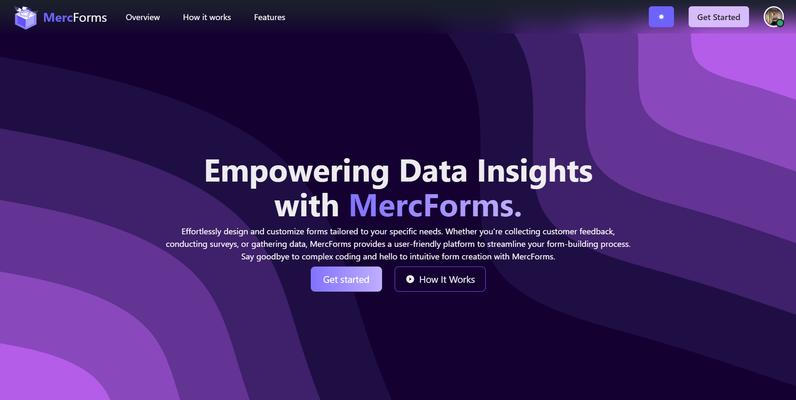

# MercForms

MercForms is a dynamic form builder and data collection platform built with React, Node.js, MongoDB, and Express. It provides an intuitive user interface for creating and sharing forms, collecting responses, and more.

## Features

- **Dynamic Form Builder:** Easily create forms with various question types such as multiple-choice, paragraphs, and more.

- **Form Sharing:** Share your forms with others and gather their responses.

- **Image Embedding:** Enhance your forms by embedding images.

- **User Responses:** View and analyze responses from users.

- **Form Link Sharing:** Share form links for easy access.

- **Form Invite via Email:** Send form invites via email to your contacts.

## Prerequisites

Before you begin, ensure you have met the following requirements:

- Node.js and yarn installed.
- MongoDB installed and running.
- Access to SMTP email service for email functionality.

## Installation

1. Clone the repository:

```bash
git clone https://github.com/your-username/MercForms.git
cd MercForms
```

2. Install server dependencies:

```bash
cd backend
yarn
```

3. Install client dependencies:

```bash
cd merc-forms
yarn
```

4. Create a `.env` file in both the `server` and `client` directories and add the following environment variables:

```env
# Server .env
JWT_SEC_KEY=your_secret_key
MONGODB_URI=mongodb://localhost:27017/your_db_name
PORT=5000
SERVER_URL=http://localhost:5000

# Email Configuration
MAIL_SERVER=your_email_server
MAIL_PORT=your_email_port
MAIL_HOST=your_email_host
MAIL_PASSWORD=your_email_password
MAIL_ID=your_email_id

# Client .env
REACT_PUBLIC_API_BASE_URL=http://localhost:5000/api
```

## Usage

1. Start the server:

```bash
cd backend
yarn dev
```

2. Start the client:

```bash
cd merc-forms
yarn dev
```

3. Access the MercForms application in your web browser at `http://localhost:3000`.

## License

This project is licensed under the MIT License - see the [LICENSE](LICENSE) file for details.

## Acknowledgments

- [React](https://reactjs.org/)
- [Node.js](https://nodejs.org/)
- [MongoDB](https://www.mongodb.com/)
- [Express](https://expressjs.com/)

---

**Note:** Replace placeholders like `your-username`, `your_secret_key`, `your_db_name`, `your_email_server`, `your_email_port`, `your_email_host`, `your_email_password`, and `your_email_id` with your actual values.
